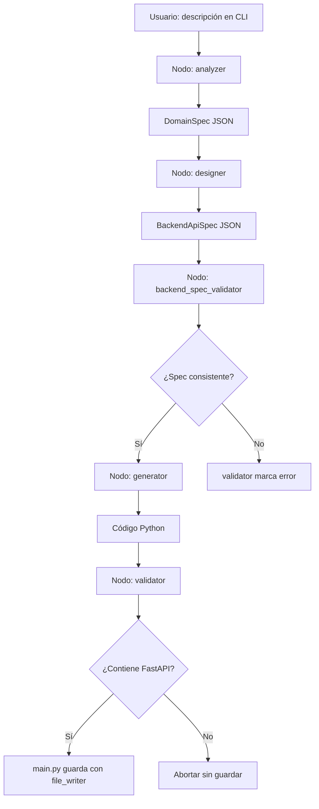

# Guía completa de sustentación — AgenteApis

Documento único para preparar la presentación al profesor: visión del proyecto, arquitectura técnica, ejecución paso a paso, limitaciones actuales y posibles preguntas con respuestas sugeridas.

---

## Tabla de contenidos

1. [Resumen ejecutivo](#1-resumen-ejecutivo)
2. [Problema y propuesta de valor](#2-problema-y-propuesta-de-valor)
3. [Estado actual del proyecto](#3-estado-actual-del-proyecto)
4. [Arquitectura técnica](#4-arquitectura-técnica)
5. [Flujo agentic (LangGraph)](#5-flujo-agentic-langgraph)
6. [Agentes y responsabilidades](#6-agentes-y-responsabilidades)
7. [Modelos de datos intermedios](#7-modelos-de-datos-intermedios)
8. [Integración con el LLM](#8-integración-con-el-llm)
9. [Estructura de archivos](#9-estructura-de-archivos)
10. [Formatos de entrada soportados](#10-formatos-de-entrada-soportados)
11. [Validaciones implementadas](#11-validaciones-implementadas)
12. [Salida generada (API FastAPI)](#12-salida-generada-api-fastapi)
13. [Dependencias y tecnologías](#13-dependencias-y-tecnologías)
14. [Plan de sprints (visión futura)](#14-plan-de-sprints-visión-futura)
15. [Paso a paso para ejecutar el proyecto](#15-paso-a-paso-para-ejecutar-el-proyecto)
16. [Demo sugerida para el profesor](#16-demo-sugerida-para-el-profesor)
17. [Limitaciones y riesgos (ser honesto)](#17-limitaciones-y-riesgos-ser-honesto)
18. [Posibles preguntas del profesor y respuestas](#18-posibles-preguntas-del-profesor-y-respuestas)
19. [Glosario rápido](#19-glosario-rápido)

---

## 1. Resumen ejecutivo

**AgenteApis** es un sistema de **agentes de IA** (no un simple “prompt a código”) que, a partir de una descripción de dominio, produce una **API REST con FastAPI** lista para ejecutar.

**Idea central:**

```
Entrada (lenguaje natural, JSON o esquema básico)
    → Análisis del dominio
    → Diseño de especificación backend
    → Validación de consistencia
    → Generación de código Python
    → Validación mínima del código
    → Archivo guardado en generated_api/main.py
```

El diferencial frente a un generador lineal es la **separación en etapas especializadas**, orquestadas con **LangGraph**, y el uso de **especificaciones estructuradas** (Pydantic) entre agentes para dar trazabilidad y control.

---

## 2. Problema y propuesta de valor

### Problema

Crear un backend CRUD desde cero implica trabajo repetitivo: modelar entidades, definir rutas, escribir validaciones, documentar endpoints y probar. Eso consume tiempo y es propenso a inconsistencias cuando el dominio cambia.

### Propuesta

Un **agente backend automatizado** que actúe como un “ingeniero junior”:

| Etapa humana tradicional | Equivalente en AgenteApis |
|--------------------------|---------------------------|
| Entender el negocio      | Agente Analizador         |
| Diseñar API y relaciones | Agente Diseñador          |
| Revisar diseño           | Validador de especificación |
| Implementar FastAPI      | Agente Generador          |
| Revisar que compile      | Validador de código       |

### Valor para el usuario

- Reduce tiempo en el **esqueleto inicial** de una API.
- Estandariza salida en **FastAPI + Pydantic**.
- Permite iterar cambiando solo la descripción del dominio.
- Base para evolucionar hacia corrección automática, tests y documentación (sprints futuros).

---

## 3. Estado actual del proyecto

Según el código y la documentación del repositorio:

| Sprint (plan) | Estado | Qué incluye |
|---------------|--------|-------------|
| Sprint 1 — Arquitectura agentic | **Implementado** | LangGraph, agente analizador, módulos separados, CLI |
| Sprint 2 — Diseñador + spec backend | **Implementado** | `BackendApiSpec`, validador de consistencia, ejemplo ecommerce |
| Sprint 3 — Generador ejecutable | **Implementado** | Código FastAPI guardado en disco |
| Sprint 4 — Validador + Corrector con ciclo | **Parcial** | Solo validación mínima (`FastAPI()`); sin agente corrector ni reintentos |
| Sprint 5 — Documentador + Tests | **Pendiente** | No hay generación automática de pytest ni README del artefacto |

**Versión monolítica anterior:** `generator.py` + `prompts.py` con una sola llamada al LLM. Ese código **sigue existiendo** como utilidad/legado, pero el flujo principal en `main.py` usa **`run_agentic_flow`** (arquitectura agentic).

---

## 4. Arquitectura técnica

### Vista de capas

```
┌─────────────────────────────────────────────────────────┐
│  Capa de presentación: main.py (CLI)                    │
├─────────────────────────────────────────────────────────┤
│  Orquestación: workflows/agentic_flow.py (LangGraph)    │
├─────────────────────────────────────────────────────────┤
│  Agentes: analyzer, designer, generator_agent           │
├─────────────────────────────────────────────────────────┤
│  Esquemas: schemas/domain.py, schemas/backend_spec.py   │
├─────────────────────────────────────────────────────────┤
│  Infraestructura IA: llm_client.py, prompts.py          │
├─────────────────────────────────────────────────────────┤
│  Persistencia salida: file_writer.py → generated_api/   │
└─────────────────────────────────────────────────────────┘
```

### Diagrama del flujo (Mermaid)



---

## 5. Flujo agentic (LangGraph)

**Archivo clave:** `agent/workflows/agentic_flow.py`

LangGraph modela el proceso como un **grafo de estados** (`AgenticState`). Cada nodo recibe el estado, ejecuta una función y devuelve campos actualizados.

### Estado compartido (`AgenticState`)

| Campo | Descripción |
|-------|-------------|
| `user_requirement` | Texto que escribe el usuario en consola |
| `domain_spec` | Salida del analizador (dict serializado de `DomainSpec`) |
| `backend_spec` | Salida del diseñador (`BackendApiSpec`) |
| `backend_spec_ok` | Si la especificación pasó validación |
| `backend_spec_errors` | Lista de errores de consistencia |
| `generated_code` | Código Python devuelto por el generador |
| `validation_ok` | Si el código es aceptable |
| `validation_error` | Mensaje si falla validación |

### Secuencia de nodos (lineal, sin ciclos hoy)

1. `analyzer` → 2. `designer` → 3. `backend_spec_validator` → 4. `generator` → 5. `validator` → **END**

**Importante para la sustentación:** hoy **no hay arista de retroalimentación** (no se reintenta generación si falla). Eso está planificado en Sprint 4.

---

## 6. Agentes y responsabilidades

### 6.1 Agente Analizador (`agents/analyzer.py`)

**Entrada:** texto del usuario (natural, JSON o esquema básico).

**Salida:** `DomainSpec` (entidades, campos, operaciones CRUD deseadas).

**Lógica:**

1. Si el texto empieza con `{` o `[`, intenta parsear **JSON** directamente.
2. Si contiene líneas `Entidad:` y `Atributos:`, usa **esquema básico** sin LLM.
3. Si no, llama al LLM con `build_analyzer_messages()` y espera JSON.
4. Si el LLM falla o devuelve JSON inválido → **fallback local** con entidad genérica `Item`.

**Temperatura LLM:** 0.1 (respuestas más deterministas).

### 6.2 Agente Diseñador (`agents/designer.py`)

**Entrada:** `DomainSpec` (objeto o dict).

**Salida:** `BackendApiSpec` (entidades, atributos, relaciones, endpoints CRUD y relacionales).

**Lógica:**

1. Serializa el dominio a JSON.
2. Llama al LLM con `build_backend_designer_messages()`.
3. Parsea JSON de respuesta y valida con Pydantic.
4. Si falla → **fallback** con entidad `Item` y 5 endpoints CRUD estándar.

**Función adicional:** `validate_backend_spec_consistency()` — validación **sin LLM**, por código.

### 6.3 Validador de especificación (mismo módulo designer)

Comprueba:

- Que exista al menos una entidad.
- Que `source_entity` y `target_entity` de relaciones existan en la lista de entidades.
- Que `relation_type` sea `one_to_one`, `one_to_many` o `many_to_many`.
- Que los endpoints CRUD y relacionales referencien entidades válidas.

### 6.4 Agente Generador (`agents/generator_agent.py`)

**Entrada:** `BackendApiSpec` serializado a JSON.

**Salida:** string con código Python de un único archivo FastAPI.

**Lógica:**

1. Prompt en `build_generator_from_spec_messages()`.
2. Llamada al LLM (temperatura 0.2).
3. Limpieza de cercas markdown ` ```python ` si el modelo las añade.

### 6.5 Validador de código (`generator.py` + nodo `validator`)

Función `validate_has_fastapi_app(code)`:

```python
return "FastAPI()" in code
```

Es una validación **mínima por cadena de texto**, no análisis AST ni ejecución del código.

---

## 7. Modelos de datos intermedios

### 7.1 DomainSpec (`schemas/domain.py`)

Representa el **dominio de negocio** interpretado del usuario.

| Modelo | Campos principales |
|--------|-------------------|
| `DomainField` | `name`, `type`, `required` |
| `DomainEntity` | `name`, `plural_name`, `description`, `fields`, `operations` |
| `DomainSpec` | `original_request`, `entities[]`, `constraints[]` |

**Ejemplo conceptual:**

```json
{
  "original_request": "API de tareas con título y estado",
  "entities": [{
    "name": "Task",
    "plural_name": "Tasks",
    "fields": [
      {"name": "id", "type": "int", "required": true},
      {"name": "title", "type": "str", "required": true},
      {"name": "status", "type": "str", "required": true}
    ],
    "operations": ["create", "list", "get", "update", "delete"]
  }],
  "constraints": []
}
```

### 7.2 BackendApiSpec (`schemas/backend_spec.py`)

Representa el **diseño técnico de la API** antes de generar código.

| Modelo | Propósito |
|--------|-----------|
| `BackendAttribute` | Atributos con `unique` |
| `BackendEntity` | Entidad con lista de atributos |
| `BackendRelation` | Relaciones 1:1, 1:N, N:M |
| `BackendEndpoint` | Método HTTP, path, operación |
| `BackendApiSpec` | Spec completa + notas de consistencia |

**Ejemplo de referencia en el repo:** `agent/examples/ecommerce_backend_spec.json` (usuarios, productos, órdenes, items, relaciones y endpoints anidados).

---

## 8. Integración con el LLM

**Archivo:** `agent/llm_client.py`

| Variable de entorno | Obligatoria | Default / uso |
|---------------------|-------------|---------------|
| `OPENAI_API_KEY` | Sí | Autenticación contra OpenAI o proveedor compatible |
| `OPENAI_MODEL` | No | `gpt-4o-mini` |
| `OPENAI_BASE_URL` | No | URL alternativa (Azure, LiteLLM, Ollama compatible, etc.) |

**API usada:** Chat Completions de OpenAI (`client.chat.completions.create`).

**Manejo de errores:** excepción personalizada `LLMError` con mensajes claros (clave faltante, red, respuesta vacía).

**Carga de configuración:** `python-dotenv` lee `agent/.env` al importar el módulo.

**Seguridad:** `.env` está en `.gitignore`; nunca subir la API key al repositorio.

---

## 9. Estructura de archivos

```
Agente_Apis/
├── GUIA_SUSTENTACION.md          ← este documento
├── DOCUMENTACION.md              ← descripción por archivo (legado)
├── propuesta_agente_backend_automatizado.md
├── sprintRecomendaciones.md      ← plan de sprints y visión
└── agent/
    ├── main.py                   ← entrada CLI
    ├── llm_client.py             ← cliente OpenAI
    ├── prompts.py                ← prompts de todos los agentes
    ├── generator.py              ← validación + generador legado
    ├── file_writer.py            ← escribe generated_api/main.py
    ├── requirements.txt
    ├── .env                      ← crear localmente (no en git)
    ├── .gitignore
    ├── agents/
    │   ├── analyzer.py
    │   ├── designer.py
    │   └── generator_agent.py
    ├── schemas/
    │   ├── domain.py
    │   └── backend_spec.py
    ├── workflows/
    │   └── agentic_flow.py       ← grafo LangGraph
    ├── examples/
    │   └── ecommerce_backend_spec.json
    └── generated_api/
        ├── __init__.py
        └── main.py               ← SALIDA: API generada (sobrescribible)
```

---

## 10. Formatos de entrada soportados

### A) Lenguaje natural (por defecto)

```
API de biblioteca con libros (título, autor, ISBN) y usuarios que pueden prestar libros
```

El analizador usa el LLM para inferir entidades y campos.

### B) JSON estructurado

Si el texto empieza con `{`, se parsea como JSON de dominio (sin LLM en el analizador si el JSON es válido).

### C) Esquema básico (sin LLM en analizador)

```
Entidad: Libro
Atributos: titulo:str, autor:str, anio:int
```

Reglas: líneas que empiezan con `Entidad:` y `Atributos:` (case insensitive en la detección).

---

## 11. Validaciones implementadas

| Nivel | Qué valida | Cómo |
|-------|------------|------|
| Especificación backend | Entidades, relaciones, endpoints | Código Python en `validate_backend_spec_consistency` |
| Código generado | Presencia de `FastAPI()` | Búsqueda de substring en `validate_has_fastapi_app` |
| Modelos Pydantic | Forma del JSON intermedio | `model_validate()` al parsear respuestas |

**Lo que NO valida hoy:**

- Sintaxis Python (`ast.parse`)
- Que la API arranque sin errores
- Que existan todos los endpoints de la spec
- Seguridad del código generado

---

## 12. Salida generada (API FastAPI)

Tras ejecutar `python main.py` con éxito, el código queda en:

**`agent/generated_api/main.py`**

Características típicas del código generado:

- `app = FastAPI()`
- Modelos **Pydantic** (`BaseModel`)
- Almacenamiento **en memoria** (listas o dicts en Python)
- Endpoints **CRUD** (POST, GET, PUT, DELETE)
- A veces **CORS** con `CORSMiddleware`
- Comentario al final con comando uvicorn

**Documentación automática:** al levantar con Uvicorn, FastAPI expone Swagger en `/docs` y ReDoc en `/redoc`.

**Limitación explícita:** no hay base de datos persistente; al reiniciar el servidor se pierden los datos en memoria.

---

## 13. Dependencias y tecnologías

**Archivo:** `agent/requirements.txt`

| Paquete | Rol en el proyecto |
|---------|-------------------|
| `fastapi` | Framework de la API generada |
| `uvicorn` | Servidor ASGI para ejecutar la API |
| `pydantic` | Modelos estructurados (dominio, backend spec, API generada) |
| `openai` | Cliente para el LLM |
| `python-dotenv` | Variables de entorno desde `.env` |
| `langgraph` | Orquestación del flujo agentic |

**Requisitos de entorno:**

- Python **3.10+**
- Conexión a internet (llamadas al LLM)
- Cuenta/proveedor con API compatible OpenAI

---

## 14. Plan de sprints (visión futura)

Resumen del roadmap en `sprintRecomendaciones.md`:

| Sprint | Objetivo |
|--------|----------|
| 4 | Agente validador robusto + agente corrector con **ciclo** en LangGraph (reintentos limitados) |
| 5 | Agente documentador (README, resumen endpoints) + generación de **pytest** + demo pulida |

Funcionalidades de la **propuesta completa** (aún no todas implementadas):

- JWT, paginación, capas controller/service/repository
- Tests unitarios y de integración generados
- Docker, interfaz web (Streamlit)

**Mensaje para el profesor:** el proyecto ya demuestra arquitectura multiagente y especificación intermedia; la hoja de ruta justifica el alcance académico y la evolución.

---

## 15. Paso a paso para ejecutar el proyecto

### Prerrequisitos

1. Tener **Python 3.10 o superior** instalado.
2. Tener una **API key** de OpenAI (u otro proveedor compatible).
3. Tener conexión a internet.

### Paso 1 — Abrir terminal en la carpeta del agente

**PowerShell (Windows):**

```powershell
cd "c:\Users\JulianG\Desktop\USB\Electiva cinco\Agente_Apis\agent"
```

### Paso 2 — Crear entorno virtual (recomendado)

```powershell
python -m venv .venv
.\.venv\Scripts\Activate.ps1
```

Si PowerShell bloquea scripts:

```powershell
Set-ExecutionPolicy -Scope Process -ExecutionPolicy Bypass
.\.venv\Scripts\Activate.ps1
```

### Paso 3 — Instalar dependencias

```powershell
pip install -r requirements.txt
```

### Paso 4 — Configurar variables de entorno

Crear el archivo `agent/.env` con este contenido (reemplazar con tu clave real):

```env
OPENAI_API_KEY=sk-tu-clave-aqui
OPENAI_MODEL=gpt-4o-mini
```

Opcional (otro proveedor compatible):

```env
OPENAI_BASE_URL=https://tu-proveedor.com/v1
```

> **Nota:** El README menciona `.env.example`, pero puede no existir en el repo; basta con crear `.env` manualmente.

### Paso 5 — Ejecutar el agente generador

```powershell
python main.py
```

Cuando aparezca el prompt `>`, escribir el requerimiento, por ejemplo:

```
API de productos con nombre, precio y categoría. CRUD completo.
```

Presionar **Enter**.

**Salida esperada si todo va bien:**

```
API generada correctamente en: ...\agent\generated_api\main.py
Entidades detectadas por el agente analizador: N
...
Ejecuta la API con:
  uvicorn generated_api.main:app --reload
```

**Códigos de salida de `main.py`:**

| Código | Significado |
|--------|-------------|
| 0 | Éxito |
| 1 | No se ingresó requerimiento |
| 2 | Error del LLM (`LLMError`) |
| 3 | Validación falló (no se guardó archivo) |
| 4 | Flujo no devolvió código |

### Paso 6 — Levantar la API generada

Desde la misma carpeta `agent/`:

```powershell
uvicorn generated_api.main:app --reload
```

### Paso 7 — Probar en el navegador

| URL | Qué es |
|-----|--------|
| http://127.0.0.1:8000/docs | Swagger UI (probar endpoints) |
| http://127.0.0.1:8000/redoc | Documentación alternativa |
| http://127.0.0.1:8000/openapi.json | Esquema OpenAPI en JSON |

### Paso 8 — Detener servicios

- En la terminal de uvicorn: **Ctrl + C**
- Para desactivar el venv: `deactivate`

### Solución de problemas frecuentes

| Error | Causa probable | Solución |
|-------|----------------|----------|
| `Falta OPENAI_API_KEY` | No hay `.env` o está vacío | Crear `agent/.env` con la clave |
| `Fallo al llamar al LLM` | Clave inválida, sin crédito, red | Verificar cuenta OpenAI y conexión |
| Validación no pasó | Modelo devolvió texto sin `FastAPI()` | Reintentar o cambiar `OPENAI_MODEL` |
| `ModuleNotFoundError: langgraph` | Dependencias no instaladas | `pip install -r requirements.txt` |
| Puerto 8000 ocupado | Otra app usando el puerto | `uvicorn generated_api.main:app --reload --port 8001` |

---

## 16. Demo sugerida para el profesor

**Duración aproximada:** 5–8 minutos.

1. **Contexto (1 min):** explicar que no es un chatbot que escribe código de una vez, sino un pipeline de agentes con LangGraph.
2. **Mostrar el grafo** (diagrama de la sección 5 o el README).
3. **Ejecutar en vivo:** `python main.py` con un dominio simple, por ejemplo *“API de estudiantes con nombre, email y carrera”*.
4. **Mencionar artefactos intermedios:** entidades detectadas impresas en consola.
5. **Abrir `generated_api/main.py`:** señalar modelos Pydantic y rutas CRUD.
6. **Levantar uvicorn** y abrir `/docs`.
7. **Crear un recurso** desde Swagger (POST) y listarlo (GET).
8. **Cerrar con roadmap:** corrector, validación AST, tests (Sprints 4–5).
9. **Mostrar ejemplo ecommerce:** `examples/ecommerce_backend_spec.json` como diseño previo a código.

---

## 17. Limitaciones y riesgos (ser honesto)

Conviene decirlas antes de que el profesor las pregunte:

1. **Dependencia del LLM:** la calidad varía; a veces hay alucinaciones o código incompleto.
2. **Validación débil del código:** solo busca `FastAPI()`, no garantiza ejecución correcta.
3. **Sin persistencia:** memoria RAM, datos se pierden al reiniciar.
4. **Sin agente corrector:** no hay reintentos automáticos si falla validación o sintaxis.
5. **Costo y latencia:** cada ejecución hace **varias llamadas** al LLM (analizador + diseñador + generador).
6. **Fallback genérico:** si el JSON del LLM es inválido, puede generarse una API de `Item` genérica.
7. **Seguridad:** el código generado no está auditado; no usar en producción sin revisión humana.
8. **Propuesta vs implementación:** JWT, paginación, tests automáticos están en la visión pero no en el código actual.

---

## 18. Posibles preguntas del profesor y respuestas

### Conceptuales

**P: ¿Por qué llaman “agentes” a esto y no solo “funciones que llaman al GPT”?**  
**R:** Porque cada módulo tiene un **rol especializado**, un **prompt distinto** y produce un **artefacto intermedio estructurado** que el siguiente agente consume. LangGraph **orquesta** el flujo con estado compartido, lo que permite extender con ciclos de corrección y decisiones — base de sistemas agentic, no un único prompt monolítico.

**P: ¿Cuál es la “fuente de verdad”?**  
**R:** La entrada del usuario: puede ser lenguaje natural, JSON o un esquema básico (`Entidad:` / `Atributos:`). Esa fuente se transforma primero en `DomainSpec` y luego en `BackendApiSpec` antes de generar código.

**P: ¿Qué problema académico o industrial resuelven?**  
**R:** Automatizar el **trabajo repetitivo** del backend inicial (CRUD, modelos, rutas, documentación OpenAPI vía FastAPI), acelerando prototipos y reduciendo errores de inconsistencia entre diseño e implementación.

### Técnicas

**P: ¿Por qué LangGraph y no solo encadenar funciones en Python?**  
**R:** LangGraph permite modelar **nodos, estado tipado y futuros ciclos** (validar → corregir → regenerar) sin reescribir toda la orquestación. Hoy el grafo es lineal, pero la herramienta está elegida para el Sprint 4.

**P: ¿Por qué Pydantic en los esquemas intermedios?**  
**R:** Valida la forma del JSON que devuelve el LLM, da **errores claros** si falta un campo y permite serializar/deserializar entre nodos del grafo de forma segura.

**P: ¿Por qué FastAPI y no Flask o Django?**  
**R:** FastAPI genera **OpenAPI/Swagger automáticamente**, usa type hints y Pydantic de forma nativa, y es estándar para APIs REST modernas en Python — alineado con la propuesta del proyecto.

**P: ¿Cuántas llamadas al LLM hace cada ejecución?**  
**R:** Típicamente **tres**: analizador (si no aplica JSON/esquema básico), diseñador y generador. El validador de spec y el de código **no** usan LLM.

**P: ¿Qué pasa si el LLM devuelve markdown en lugar de código puro?**  
**R:** Las funciones `_strip_code_fences` en analyzer, designer y generator eliminan bloques ` ```json ` o ` ```python ` antes de procesar.

**P: ¿Cómo validan la especificación backend?**  
**R:** Con reglas deterministas: entidades existentes, tipos de relación permitidos, endpoints que referencian entidades definidas. No depende del modelo para esa parte.

**P: ¿Por qué la validación del código solo busca `FastAPI()`?**  
**R:** Es un **MVP** del Sprint 3; el Sprint 4 planea AST, imports, endpoints esperados y ciclo corrector. Es una limitación conocida.

### Arquitectura y diseño

**P: ¿Dónde está el patrón Repository o las capas service/controller?**  
**R:** En la **propuesta completa** sí; en la **implementación actual** el generador produce un **archivo único** monolítico a propósito (simplicidad, MVP). La `BackendApiSpec` ya separa diseño de implementación para evolucionar hacia capas.

**P: ¿Cómo modelan relaciones muchos a muchos?**  
**R:** En `BackendRelation` con `relation_type: many_to_many` y endpoints relacionales en `relational_endpoints`. El ejemplo ecommerce usa tablas lógicas tipo `OrderItem` como entidad intermedia.

**P: ¿Pueden entrar DDL SQL o UML?**  
**R:** Hoy **no** directamente; el plan de sprints lo contempla. Lo más cercano es JSON o esquema básico; SQL/UML sería extensión del analizador.

### Seguridad y ética

**P: ¿Es seguro ejecutar el código generado sin leerlo?**  
**R:** **No** para producción. Siempre revisar manualmente: el LLM puede generar imports inseguros o lógica incorrecta. Para la demo académica, entorno local aislado es suficiente.

**P: ¿Cómo protegen la API key?**  
**R:** Archivo `.env` local, listado en `.gitignore`, nunca commitear secretos.

### Evaluación del proyecto

**P: ¿Qué entregables tienen hoy vs la propuesta PDF/MD?**  
**R:** Hoy: flujo agentic funcional, spec intermedia, API FastAPI en memoria, ejemplo ecommerce, CLI. Pendiente: corrección iterativa, tests generados, documentador automático, JWT, BD real.

**P: ¿Cómo medirían la calidad del sistema?**  
**R:** Métricas posibles: % de ejecuciones que pasan validación, API que arranca sin error, cobertura de endpoints respecto a `BackendApiSpec`, tiempo de generación, revisión humana con checklist.

**P: ¿Qué harían con más tiempo?**  
**R:** Sprint 4 (corrector + validación AST), Sprint 5 (pytest + README automático), persistencia con SQLite, y trazabilidad guardando prompts y specs en disco.

### Preguntas trampa (respuestas directas)

**P: ¿El sistema “piensa” o solo concatena prompts?**  
**R:** No hay razonamiento simbólico propio; **orquesta** llamadas al LLM con contexto estructurado y validaciones deterministas. El valor está en la **arquitectura de pipeline**, no en conciencia del modelo.

**P: ¿Reemplaza a un desarrollador backend?**  
**R:** **No.** Genera prototipos; revisión humana, pruebas, seguridad y operación siguen siendo necesarias.

**P: ¿Por qué no usan base de datos?**  
**R:** Decisión de alcance del MVP: reduce complejidad y dependencias en la demo; la spec ya modela relaciones para cuando se conecte SQLAlchemy u ORM.

---

## 19. Glosario rápido

| Término | Significado en este proyecto |
|---------|------------------------------|
| **Agente** | Módulo con rol, prompt y salida estructurada |
| **LangGraph** | Librería para grafos de estado con nodos |
| **DomainSpec** | Modelo de dominio de negocio |
| **BackendApiSpec** | Diseño técnico de API (rutas, relaciones) |
| **LLM** | Large Language Model (ej. GPT-4o-mini) |
| **CRUD** | Create, Read, Update, Delete |
| **Fallback** | Plan B local si falla el LLM |
| **Fuente de verdad** | Input original del usuario |
| **Uvicorn** | Servidor que ejecuta la app FastAPI |

---

## Frase de cierre sugerida para la sustentación

> *“AgenteApis implementa un flujo multiagente con LangGraph que transforma una descripción de dominio en una especificación backend validada y, a partir de ella, genera una API FastAPI ejecutable. Hoy completamos los sprints 1–3; los sprints 4 y 5 añadirán corrección automática, validación robusta y generación de pruebas y documentación, acercándonos a la propuesta de un ingeniero backend automatizado.”*

---

*Documento generado para sustentación académica — proyecto AgenteApis (Electiva V). Última revisión según código del repositorio.*
