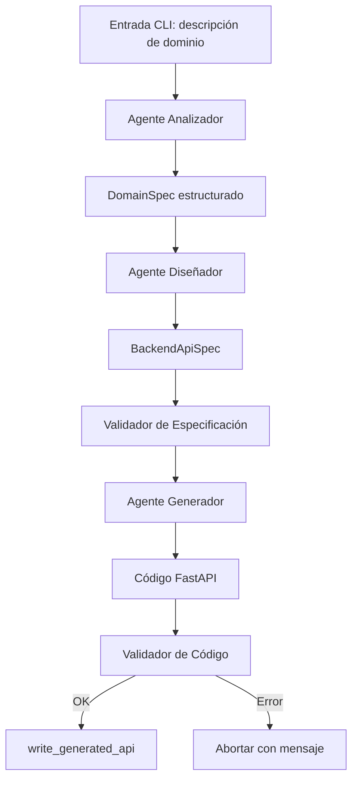

# Agente generador de APIs (arquitectura agentic)

Herramienta de línea de comandos que usa un LLM (API compatible con OpenAI) para generar una API **FastAPI** mínima con **CRUD en memoria** y la guarda en `generated_api/main.py`.

Desde este sprint, el sistema usa una arquitectura **agentic** con flujo en **LangGraph**:
- agente analizador: interpreta el dominio y lo convierte a estructura
- agente diseñador: diseña especificación backend estructurada
- validador de especificación: comprueba consistencia de entidades/relaciones/endpoints
- agente generador: construye código FastAPI desde la especificación diseñada
- validador de código: comprueba salida mínima antes de persistir

## Requisitos

- Python 3.10+
- Clave en `agent/.env` (ver abajo) o variable de entorno `OPENAI_API_KEY`
- Opcional: `OPENAI_BASE_URL` (p. ej. proveedor compatible), `OPENAI_MODEL` (por defecto `gpt-4o-mini`)

## Instalación

```bash
cd agent
pip install -r requirements.txt
```

Si aún no tienes `.env`, duplica la plantilla (PowerShell: `Copy-Item .env.example .env`; en macOS/Linux: `cp .env.example .env`).

Edita `agent/.env` y pega tu clave en `OPENAI_API_KEY=...`. Ese archivo está en `.gitignore` para no subir secretos.

## Uso

1. Generar código:

```bash
python main.py
```

Escribe algo como: `API de tareas con título y estado`.

2. Levantar la API generada (desde la carpeta `agent`):

```bash
uvicorn generated_api.main:app --reload
```

Abre la documentación interactiva en `http://127.0.0.1:8000/docs`.

## Estructura

- `main.py` — entrada por consola y flujo principal
- `llm_client.py` — llamada al modelo
- `prompts.py` — prompts reutilizables (análisis, diseño y generación)
- `generator.py` — validación y utilidades de generación
- `file_writer.py` — escribe `generated_api/main.py`
- `agents/analyzer.py` — agente analizador (texto -> `DomainSpec`)
- `agents/designer.py` — agente diseñador (`DomainSpec`/JSON/esquema -> `BackendApiSpec`)
- `agents/generator_agent.py` — agente generador (`BackendApiSpec` -> código)
- `schemas/domain.py` — modelos estructurados del dominio
- `schemas/backend_spec.py` — especificación intermedia de backend
- `workflows/agentic_flow.py` — grafo LangGraph del flujo principal
- `examples/ecommerce_backend_spec.json` — ejemplo de especificación ecommerce

## Flujo agentic



## Notas

- El sistema conserva la compatibilidad de CLI: se sigue usando `python main.py`.
- El diseñador soporta entradas de dominio en lenguaje natural, JSON o esquema básico.
- El validador comprueba que el código contenga `FastAPI()` antes de guardarlo.
- No se incluye base de datos; la API generada usa almacenamiento en memoria.
